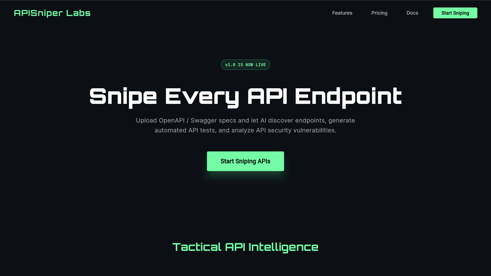
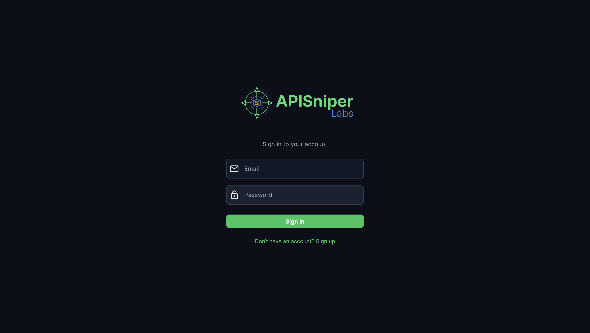
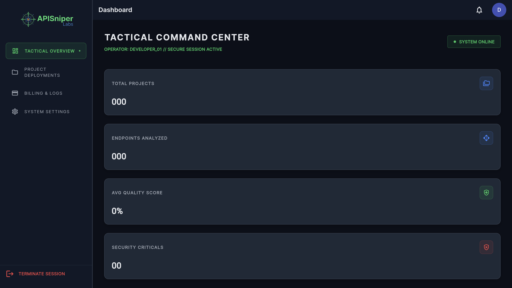
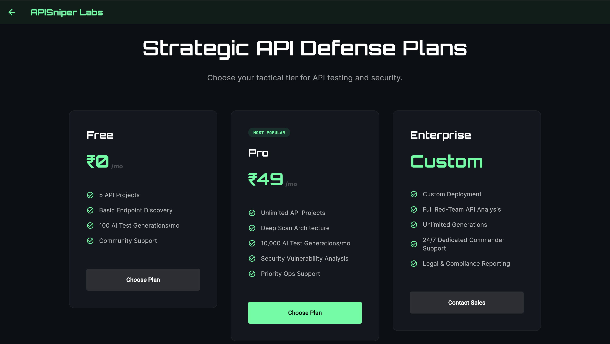
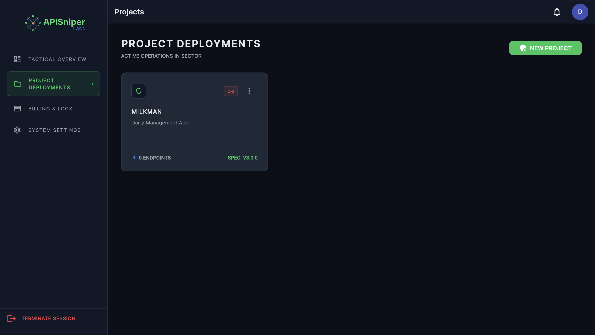
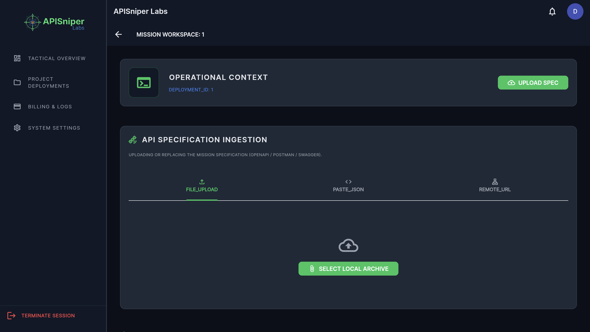
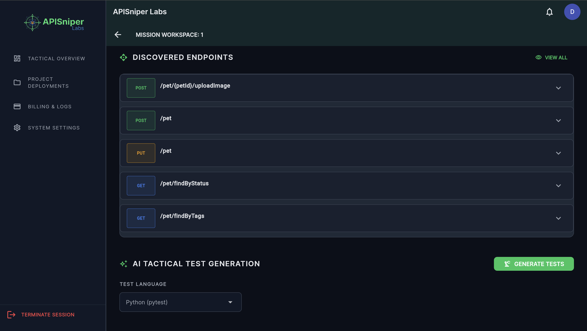
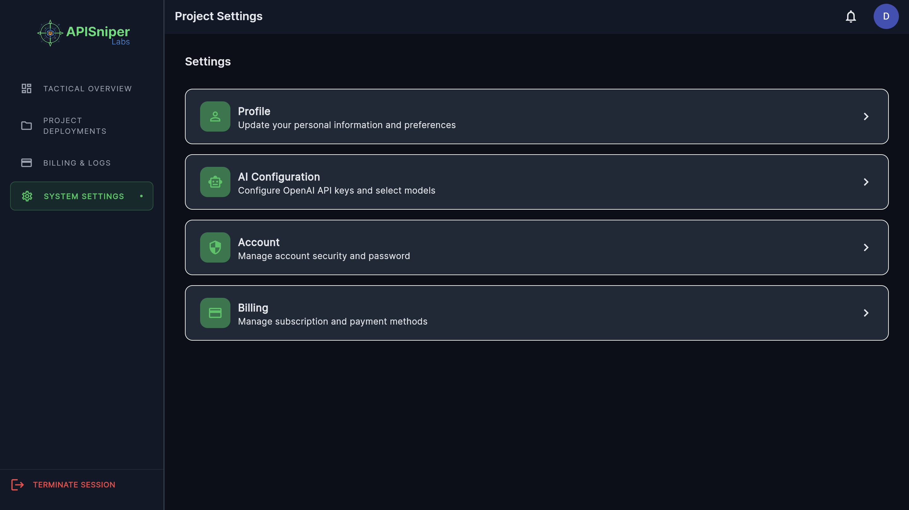

# 🚀 APISniper Labs

APISniper Labs is an AI-powered API testing and security platform that helps developers analyze API specifications, discover endpoints, generate automated tests, and identify vulnerabilities — all in one place.

Built for speed, scalability, and developer productivity.

---

## ✨ Features

* 🔍 **Endpoint Discovery**
  Automatically extract and visualize endpoints from OpenAPI, Swagger, or Postman collections.

* 🤖 **AI Test Generation**
  Generate automated API test cases in multiple programming languages.

* 🛡️ **Security Analysis**
  Detect potential vulnerabilities and security risks in your APIs.

* ⚡ **Fast & Scalable**
  Designed for high-performance workflows using modern backend architecture.

* 🌐 **Web-Based Dashboard**
  Clean and responsive UI built with Flutter Web.

---

## 🏗️ Tech Stack

**Frontend**

* Flutter Web
* BLoC (State Management)
* Clean Architecture

**Backend**

* FastAPI (Python)
* PostgreSQL

**Infrastructure (Planned / Optional)**

* AWS (Deployment & Scaling)
* CI/CD Pipelines

---

## 📸 Screenshots

### Landing Page



### Login



### Dashboard



### Pricing




### Project Deployment



### Project Workspace



### Endpoints



### Profile



---

## 🚀 Getting Started

### Prerequisites

* Flutter (latest stable)
* Python 3.10+
* PostgreSQL

---

### Frontend Setup

```bash
git clone https://github.com/escannorrr/apisniper-labs.git
cd apisniper-labs/frontend
flutter pub get
flutter run -d chrome
```

---

### Backend Setup

```bash
cd backend
pip install -r requirements.txt
uvicorn main:app --reload
```

---

## 🔑 Core Workflow

1. Upload API Spec (OpenAPI / Swagger / Postman)
2. Discover endpoints automatically
3. Generate AI-based test cases
4. Analyze security vulnerabilities
5. Export or integrate into your pipeline

---

## 🧭 Project Structure

```
frontend/
  ├── features/
  ├── core/
  ├── presentation/
  └── data/

backend/
  ├── app/
  ├── api/
  ├── services/
  └── models/
```

---

## 🌐 Routing (Web)

```
/            → Landing Page
/login       → Login
/pricing     → Pricing
/dashboard   → Main App
```

---

## 📌 Roadmap

* [ ] AI-powered test optimization
* [ ] CI/CD integrations (GitHub Actions, GitLab)
* [ ] Team collaboration features
* [ ] Advanced security scanning
* [ ] API monitoring

---

## 🤝 Contributing

Contributions are welcome!

1. Fork the repository
2. Create a new branch
3. Commit your changes
4. Submit a pull request

---

## 📄 License

This project is licensed under the MIT License.

---

## 💡 Vision

To become the **go-to platform for AI-driven API testing and security**, empowering developers to build safer and more reliable systems faster.

---

🔥 Built with a focus on developer experience and modern SaaS architecture.
